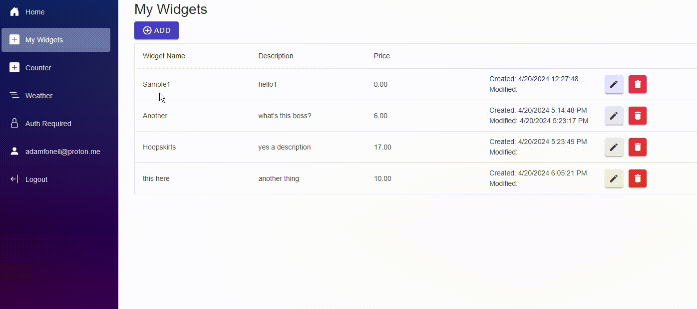

This was inspired by another Blazor project [sample-blazor8-auth-ms](https://github.com/ripteqdavid/sample-blazor8-auth-ms). I wanted to make something based on my opinions on certain things, and that gets closer to a production use case -- with some EF Core action and a minimal CRUD experience with a [Radzen](https://blazor.radzen.com/) grid. This wouldn't be possible without Dave's original project, as there were some critical Blazor WebAssembly parts I couldn't figure out on my own. I do find it surprising that there's not really a pit of success when implementing a Blazor API that requires authentication. The parts I was missing incidentally, were [CookieHandler](https://github.com/adamfoneil/ApiAuthDemo/blob/master/ApiAuthDemo/ApiAuthDemo.Client/CookieHandler.cs) and some special HttpClient initialization -- both in the [Client/Program.cs](https://github.com/adamfoneil/ApiAuthDemo/blob/master/ApiAuthDemo/ApiAuthDemo.Client/Program.cs#L14-L20) and the main app [Program.cs](https://github.com/adamfoneil/ApiAuthDemo/blob/master/ApiAuthDemo/ApiAuthDemo/Program.cs#L28-L35). I still don't understand why this code needs to be in both projects.

Part of the issue is I was trying really hard at first to use [Refit](https://github.com/reactiveui/refit) for the API client. I love Refit's productivity, but it doesn't align with Blazor authentication because Refit wants to treat the HttpClient as a singleton. Singletons don't have access to ASP.NET authentication infrastructure, so I kept running into roadblocks there. I went my own way with [ApiClientBase](https://github.com/adamfoneil/ApiAuthDemo/blob/master/ApiClientBaseLibrary/ApiClientBase.cs), and its derived class [ApiClient](https://github.com/adamfoneil/ApiAuthDemo/blob/master/ApiAuthDemo/ApiAuthDemo.Client/ApiClient.cs). This is also a little different from Dave's project because I wanted my API calls to be exposed through an interface, not called directly on `HttpClient`. (In this case, when I say "interface" I mean a class that's encapsulating some stuff, not an actual `interface`, which I feel is not necessary here.)

Speaking of the API, the endpoints are here in [Program.Endpoints.cs](https://github.com/adamfoneil/ApiAuthDemo/blob/master/ApiAuthDemo/ApiAuthDemo/Program.Endpoints.cs). This is using minimal APIs and EF Core for the underlying data access. The one little oddity you might notice is this [Save](https://github.com/adamfoneil/ApiAuthDemo/blob/master/ApiAuthDemo/ApiAuthDemo/Extensions/DbSetExtensions.cs) extension method used [here](https://github.com/adamfoneil/ApiAuthDemo/blob/master/ApiAuthDemo/ApiAuthDemo/Program.Endpoints.cs#L23). I'd prefer to use a single POST to handle both inserts and updates.

This all comes together in [Widgets/Page.razor](https://github.com/adamfoneil/ApiAuthDemo/blob/master/ApiAuthDemo/ApiAuthDemo.Client/Pages/Widgets/Page.razor), which has the Radzen grid and its infrastructure. I do a couple unique things here to minimize boilerplate -- all centered around this [GridHelper](https://github.com/adamfoneil/ApiAuthDemo/blob/master/ApiAuthDemo/ApiAuthDemo.Client/Pages/Widgets/GridHelper.cs). This is ultimately based on some work of mine in another project that encapsulates some opinionated ways I use Radzen: [Radzen.Components](https://github.com/adamfoneil/LiteInvoice3/tree/master/Radzen.Components). This gives the "are you sure" dialog when deleting a row, and simplifies the core CRUD operations as much as possible IMO.

Note, this project contains all the regular Blazor template stuff, which I am too impatient to remove.

# Time Zone Support
My eventual use case for this in production is in a multi-tenant app where auditing and permissions depend on knowing custom properties of the user, in this case [ApplicationUser](https://github.com/adamfoneil/ApiAuthDemo/blob/master/ApiAuthDemo.Data/ApplicationUser.cs). One way to demo a similar feature (without adding true multi-tenant support to this app), was to add time zone support to the [auditing features](https://github.com/adamfoneil/ApiAuthDemo/blob/master/ApiAuthDemo.Data/ApplicationDbContext.cs#L29).

I've accomplished this by:
- adding a `TimeZoneId` property to `ApplicationUser`
- adding a custom claims factory [DbClaimsPrincipalFactory](https://github.com/adamfoneil/ApiAuthDemo/blob/master/ApiAuthDemo/ApiAuthDemo/Services/DbClaimsPrincipalFactory.cs) and added it to the DI container in [Program.cs](https://github.com/adamfoneil/ApiAuthDemo/blob/master/ApiAuthDemo/ApiAuthDemo/Program.cs#L25).
- adding a `TimeZoneId` property to my db context [ApplicationDbContext](https://github.com/adamfoneil/ApiAuthDemo/blob/master/ApiAuthDemo.Data/ApplicationDbContext.cs#L13). This is set within the endpoint handler [here](https://github.com/adamfoneil/ApiAuthDemo/blob/master/ApiAuthDemo/ApiAuthDemo/Program.Endpoints.cs#L26). The user's time zone is read when parsing [user info](https://github.com/adamfoneil/ApiAuthDemo/blob/master/ApiAuthDemo/ApiAuthDemo/Program.Endpoints.cs#L43) from incoming requests.
- 